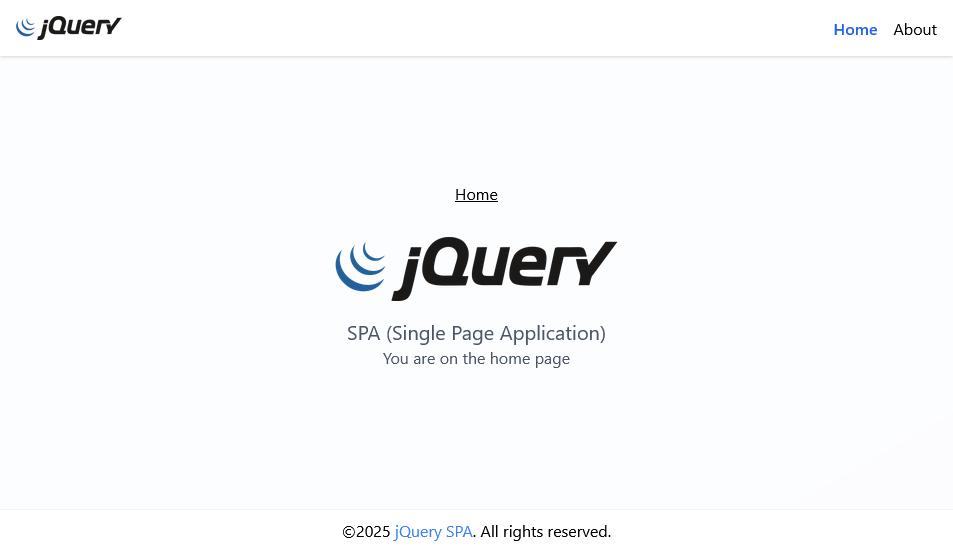

# jQuery SPA (Single Page Application)

A simple experiment to build a Single Page Application (SPA) using **jQuery**, This project is intended as an exercise to understand how SPA works manually in jQuery.

---

## 📌 Experiment Objectives

- 🔁 Trying out the SPA concept using jQuery.
- 🧠 Understand how routing works using hash (`#`) in URLs.
- 🎨 Integrating Tailwind
- ⚙️ Understand component implementation.

---

## 📁 Project Structure

```
/root
│
├── index.html
├── assets/
│   ├── css/
│   └── images/
├── src/
│   ├── components/
│   ├── pages/
│   └── routes/
└── README.md
```

---

## 💡 How to Run

- Clone this repository or download it manually.
- Open the `index.html` file in a browser using apache.

---

## 🖥️ Screenshot



---
